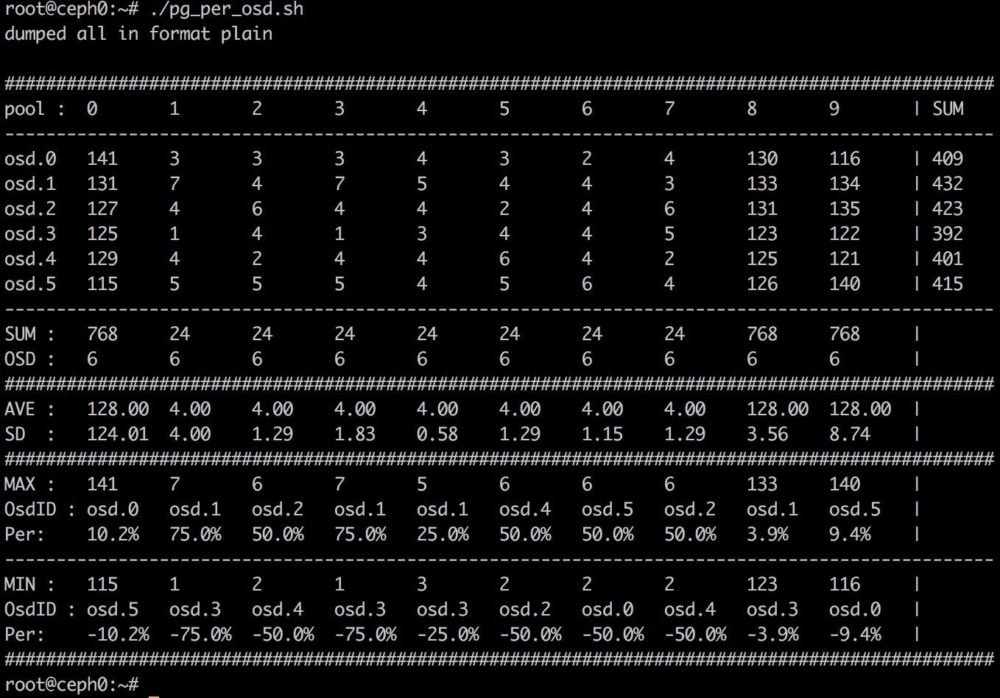

# README

该项目是在原有ceph-ansible项目基础上根据自己的需要进行的一些修改。

## 原项目地址和版本

github: https://github.com/ceph/ceph-ansible

release: 2.2.1

安装完后版本信息：
```
# ansible --version
ansible 2.3.0.0
  config file = /etc/ansible/ansible.cfg
  configured module search path = Default w/o overrides
  python version = 2.7.5 (default, Sep 15 2016, 22:37:39) [GCC 4.8.5 20150623 (Red Hat 4.8.5-4)]
```
>生产环境中建议osd的data和journal盘均采用uuid的方式挂载，并更新分区表。

## 修改
### ceph-osd role

1、在原有基础上进行了修改，使之可以更好的支持分区部署osd。

2、修改文件`scenarios/bluestore.yml`，在bluestore场景下也可以接受一个分区作为磁盘输入，部署OSD。

### install-ansible.sh

根据系统环境自动安装`lsb_release`，不必手动再安装，并校验是否安装完成。

### all.yml

1、默认 all.yml 修改后可直接用于在centos上部署ceph。

2、新增文件 all.yml.ubuntu，当在ubuntu上部署集群时直接替换 all.yml，然后少量修改即可使用。

## 新增roles
### 1、ceph-install

功能：当选择 `ceph_custom` 方式安装的时候才使用该role。在这里用于离线安装，在内网的某一台机器上搭建一个源站，然后通过yum的方式安装ceph。group/all.yml中需要开启的配置如下：
```
ceph_origin: 'upstream'
...
ceph_custom: true # use custom ceph repository
ceph_custom_repo: http://172.20.2.158/ceph-kraken-repos
...
monitor_interface: eth0
...
public_network: 172.20.2.0/24

```
其中`http://172.20.2.158/ceph-kraken-repos` 为我自己配置的内网仓库。

>1、只针对 custom 模式下使用，如果是非`custom` 模式的话在site.yml 中将该role对应的task注释掉
>2、如果是安装bluestore的话，还需要修改配置项：#osd_objectstore: filestore，将其值改为 bluestore

使用场景：离线或内网环境下的ceph集群安装

### 2、ceph-purge

**功能**：清除整个集群的信息，包括以下几件事情

- 停止所有ceph相关进程
- umount 所有osd挂载的磁盘
- 删除 /etc/ceph/ 下所有文件
- 删除 /var/lib/ceph/ 下所有文件

**新增变量**: `ceph_pkg_purge`，默认为 `false`。可在group_vars/all.yml 中开启。

**功能**：当开启时，在purge ceph集群数据完成后，会purge 掉 ceph package，以及ceph 安装版本所对应的相关依赖包，以便环境在下次安装不同版本的 ceph 时不会有问题。

**使用方法**：
当前目录下单独提供了一个yml文件 `ceph-purge.yml` 可供直接调用

### 3、firewalld

功能：关闭防火墙和selinux，在ceph部署前就执行此操作，防止在部署过程中因为该步骤未操作引发的一些问题。

默认在 `site.yml` 中开启

>在部署集群之前需要执行此操作

### 4、parted-dev

**功能**：给磁盘分区，当前支持最多一次给磁盘分五个区

**使用方法**：

1、修改 `group_vars/osds.yml` 

```
unparted_devices:
  - /dev/vdd
  - /dev/vdc

parted_num: 5

first_part_start: 1MB
first_part_end: 1GiB

second_part_start: 1GiB
second_part_end: 11GiB

third_part_start: 11GiB
third_part_end: 21GiB

fourth_part_start: 21GiB
fourth_part_end: 30GiB

fifth_part_start: 30GiB
fifth_part_end: 100%
```

- unparted_devices: 需要分区的磁盘名列表

- parted_num: 需要分几个区

- XXX_part_start: 第XXX个分区的起始位置

- XXX_part_end: 第XXX个分区的结束位置

> note: 1GiB = 1024MiB, 1GB = 1000MB = 1000 * 1000KB = 953MiB

2、调用yml文件执行

这里提供了一个单独的yml 文件：`parted-dev.yml`

```
ansible-playbook parted-dev.yml
```

>Note：如果输入的磁盘中有名称不符合规则或者输入的是一个分区（如 /dev/vdc1），会skip

### 5、rm-partition

**功能**：删除选定磁盘的所有分区（不管有几个分区，以及分区是否对称，均可完全删除）

**使用方法**：

1、修改 `group_vars/osds.yml` 

```
# parted_devices is used for role: rm-partition
parted_devices:
  - /dev/vdb
  - /dev/vdc
```

- parted_devices：需要删除分区的磁盘列表

2、调用yml文件执行

这里提供了一个单独的yml 文件：`rm-partition.yml`

```
ansible-playbook rm-partition.yml
```

> Note：如果输入的磁盘中有名称不符合规则或者输入的是一个分区（如 /dev/vdc1），会skip

以上两个role中，注意修改所提供 `.yml` 文件里的 hosts 为自己指定的组或机器

## 文件夹tools

新增一些小工具

- **pg_num-set.sh**

功能：设置集群pg和pgp数量，二者相等

使用姿势：

```
sh pg_num-set.sh {pg-num}
```

- **pg-osd.py**

功能：输出每个osd在每个pool中的pg数量，以表格形式呈现

```
# ./pg-osd.py
dumped all in format plain
pool  : 0      1      10     2      3      4      5      6      7      8      9      | SUM
------------------------------------------------------------------------------------------------
osd.0   64     8      8      8      8      8      8      8      8      8      8      | 144
osd.1   64     8      8      8      8      8      8      8      8      8      8      | 144
osd.2   64     8      8      8      8      8      8      8      8      8      8      | 144

------------------------------------------------------------------------------------------------
SUM   : 192    24     24     24     24     24     24     24     24     24     24     |
```

- **pg_per_osd.sh**

功能：同上，输出每个osd和pool中pg的数量，同时计算出pg平均值，以及最大最小pg数和其所在的osd，并计算出其和平均值之差的百分比



**参数解释：**
AVE：pg平均值
**SD：标准差(这是衡量pg分布是否均衡的参数)**
SUM: pg总数
Osd：pool中的pg分布在多少个osd中
Max：最大pg数
Min：最小pg数
Per：超出平均值的百分比
OsdID：最大/最小pg数所在的OSD id

>该脚本适用于jewel以上的版本，jewel版本请使用脚本 `pg_per_osd4jewel.sh` 

- **cpu-top.sh**

查看cpu的拓扑结构

```
# sh cpu-top.sh
===== CPU Topology Table =====

+--------------+---------+-----------+
| Processor ID | Core ID | Socket ID |
+--------------+---------+-----------+
| 0            | 0       | 0         |
+--------------+---------+-----------+
| 1            | 1       | 0         |
+--------------+---------+-----------+

Socket 0: 0 1

===== CPU Info Summary =====

Logical processors: 2
Physical socket: 1
Siblings in one socket:  2
Cores in one socket:  2
Cores in total: 2
Hyper-Threading: off

===== END =====
```

- **manual-deploy-osd.sh**

功能：手动部署OSD脚本

使用方法：先使用ansible部署ceph集群（不包含OSD），然后在每台机器上单独执行该脚本

只需要修改osd列表和磁盘列表即可(filestore的话还要修改日志盘列表)，如下：

```
# osd 和 dev 数组
array_osd=(0 1 2)
array_dev=('sdb1' 'sdc1' 'sdd1')

# 存储类型：filestore or bluestore
storage_type=bluestore

# journal devices数组
array_journal=('sdb2' 'sdc2' 'sdd2')    # for filestore only

# osd weight size, 参考值: 1T = 1.0
osd_weight=1.0
```

1、部署osd有两种方式，一种是bluestore，一种是filestore，脚本里默认是bluestore，可以通过设置 `storage_type` 开关来打开。

2、`osd_weight` 根据磁盘大小来定，1T设为1.0。如果OSD磁盘的大小不一，可以先设置一个统一值，然后通过 `ceph osd reweight` 来更改。

3、脚本里会将 osd 里的 journal 软链到指定的 journal 磁盘

4、脚本同样适用于ubuntu系统，只需修改最后启动osd的命令即可

>1、注意OSD的ID是连续且递增的，需要提前规划好
>2、不要给journal磁盘挂载目录，避免操作磁盘导致journal损坏

- **uuid-deploy-osd.sh**

功能：通过uuid挂载OSD数据和日志磁盘，来部署OSD，同时将挂载信息写入`mount_info` 文件，可作为fstab文件调用执行，也可以将内容写入 `/etc/fstab` 文件。

使用方法和 `manual-deploy-osd.sh` 相同，增加了存放 `mount_info` 信息的文件路径及命名选项：

```
# 存放OSD挂载相关信息，临时fstab。可以选择存在当前文件夹下，也可以自定义路径
fstab_info=mount_info
```

**Q: 为什么采用 `partuuid` ？**

**A:**如果你的机器上有不止一个 SATA, SCSI 或 IDE 磁盘控制器，那么它们所对应的设备节点将会依随机次序添加。这样就可能导致每次引导时设备的名字如 /dev/sda 与 /dev/sdb 互换了，最终导致系统不可引导、kernel panic、或者设备不可见。持久化命名法可以解决这些问题。

有四种持久化命名方案：by-label、by-uuid、by-id 和 by-path。对于那些使用GUID 分区表(GPT)的磁盘，还有额外的两种方案，by-partlabel 和 by-partuuid。

有些磁盘并uuid并不可见，在 `/dev/disk/by-uuid/` 中并没有，并且通过 `blkid` 也不能获得，但是每次磁盘分完区后都有 partuuid，可在 `/dev/disk/by-partuuid/` 中查看，或通过命令 `blkid` 获得。

- **ceph-client-rbd-env-check.py**

功能：检查rbd客户端是否可以正常识别文件系统。在rbd环境就绪后，可以运行脚本执行检查。

```
# python ceph-client-rbd-env-check.py
EXAMPLE:
python ceph-client-rbd-env-check.py ${pool_name}

# python ceph-client-rbd-env-check.py rbd
[PASS] get device fstype okay.
```

应付的场景：

  编译10.2.6和11.2.1版本的rbd，执行发现，在sysfs_write_rbd_add(buf)步中(该块设备已经被文件系统xfs格式化)，创建的/run/udev/data/b251\:0都为异常状态，ID_FS_TYPE字段为空。执行mount都可以正常挂载。
  实际上，通过apt-get install ceph-common的rbd存在异常，而apt-get install ceph的rbd表现正常(ceph-deploy部署的rbd是通过apt-get install ceph实现的)。
这个异常与rbd源代码没关系，而是与安装的方式有关，这可能是有组件的依赖有关系。

解决方法：

暂时无法从rbd代码层面定位问题，通过提供工具检测暂时绕过这个问题。
ceph-client-rbd-env-check.py可以协助检查rbd客户端是否可以正常识别文件系统。在rbd环境就绪后，可以运行脚本执行检查。

异常情形：

```
# cat /run/udev/data/b251\:0 
S:rbd/rbd/rbd0
I:162920386411
E:ID_FS_TYPE=
G:systemd

# python ceph-client-env-rbd-test.py rbd
[FAIL] cmd='lsblk -nd -o FSTYPE /dev/rbd0', desc='get device fstype'
```

正常情形:

```
# cat /run/udev/data/b251\:0 
S:rbd/rbd/rbd0
I:163204714535
E:ID_FS_UUID=d0296c84-56d7-4adb-89b1-9f60c6a54309
E:ID_FS_UUID_ENC=d0296c84-56d7-4adb-89b1-9f60c6a54309
E:ID_FS_TYPE=xfs
E:ID_FS_USAGE=filesystem
G:systemd

# python ceph-client-env-rbd-test.py rbd
[PASS] get device fstype okay.
```
